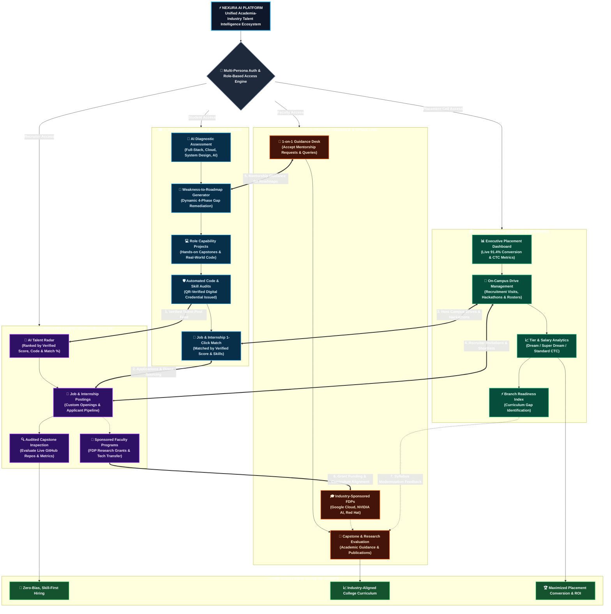

# ⚡ Nexura AI — 1-Page Project Architecture & Ecosystem Flowchart

> **Unified Academia-Industry Synergy & Talent Intelligence Platform**  
> *Connecting Students, Industry Recruiters, University Placement Cells, and Faculty Mentors into a single closed-loop intelligence engine.*

---

## 📊 End-to-End Project Flow Chart

---

## 📌 1-Page Narrative Summary (Cheat Sheet for Presentation)

| Dimension | Description |
| :--- | :--- |
| **Problem Solved** | The chronic misalignment between theoretical college curriculums and rapidly evolving industry hiring standards. |
| **Primary Users** | **Students**, **Industry Recruiters**, **University Placement Cells**, and **Faculty Mentors**. |
| **Core Innovation** | **Closed-loop AI feedback engine**: Student diagnostic gaps generate custom roadmaps, code is auto-audited for verified credentials, recruiters source audit-backed talent, while placement cells and faculty leverage industry data to modernize training. |
| **Key Metrics** | **91.4% Placement Conversion Rate**, **4-Tier CTC Analytics**, **4-Phase Dynamic Roadmaps**, **QR-Verified Digital Certificates**. |
| **Tech Foundation** | React 19, Vite 8, TailwindCSS v4, React Context API, Lucide React, LocalStorage persistence. |
